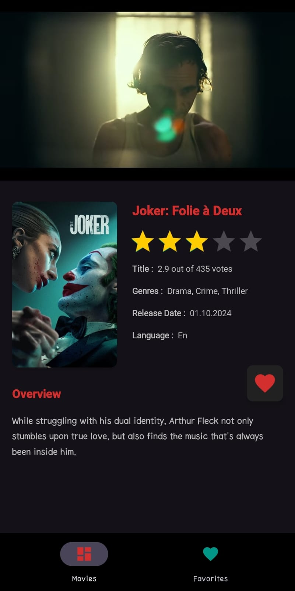

# MoviesAppXML

It's a demo project to display popular movies and track down the upcoming movies. Users can add movies to favorites for reminders.<br /><br />
Project is written in Kotlin.💯

<br />

| Mode  | Movies | Favorites | Details |
|------|------|------|------|
| Dark |  |  |  |
| Light |  |  |  |

<br />

### The Aim Of The Project
Implementing new technologies and best practices in android development such as:
- [Clean Architecture](https://medium.com/android-dev-hacks/detailed-guide-on-android-clean-architecture-9eab262a9011) - Clean architecture is a software design philosophy that separates the elements of a design into ring levels.<br /><br />
- [SOLID](https://medium.com/the-android-caf%C3%A9/solid-principles-the-kotlin-way-ff717c0d60da) - SOLID is a mnemonic acronym for five design principles intended to make software designs more understandable, flexible, and maintainable.<br /><br />
- [MVVM](https://developer.android.com/topic/libraries/architecture/viewmodel) - Its principal advantage is that it caches state and persists it through configuration changes.<br /><br />
- [HILT](https://dagger.dev/hilt) - Hilt provides a standard way to incorporate Dagger dependency injection into an Android application.<br /><br />
- [Flows](https://developer.android.com/kotlin/flow)  - In coroutines, a flow is a type that can emit multiple values sequentially, as opposed to suspend functions that return only a single value.<br /><br />
- [Coroutines](https://kotlinlang.org/docs/reference/coroutines-overview.html) - In addition to opening the doors to asynchronous programming, coroutines also provide a wealth of other possibilities, such as concurrency and actors.<br /><br />
- [Retrofit](https://square.github.io/retrofit/) - A type-safe HTTP client for Android and Java. Retrofit turns your HTTP API into a Java interface.<br /><br />
- [Room](https://developer.android.com/training/data-storage/room) - The Room persistence library provides an abstraction layer over SQLite to allow fluent database access while harnessing the full power of SQLite.<br /><br />
- [ViewBinding](https://developer.android.com/topic/libraries/view-binding) - View binding is a feature that allows you to more easily write code that interacts with views. Once view binding is enabled in a module, it generates a binding class for each XML layout file present in that module.<br /><br />
- [Glide](https://github.com/bumptech/glide) - Glide is a fast and efficient open source media management and image loading framework for Android that wraps media decoding, memory and disk caching, and resource pooling into a simple and easy to use interface.

<br />

### License
```
   Copyright (C) 2022 Mert Yazı
   Licensed under the Apache License, Version 2.0 (the "License");
   you may not use this file except in compliance with the License.
   You may obtain a copy of the License at

       http://www.apache.org/licenses/LICENSE-2.0

   Unless required by applicable law or agreed to in writing, software
   distributed under the License is distributed on an "AS IS" BASIS,
   WITHOUT WARRANTIES OR CONDITIONS OF ANY KIND, either express or implied.
   See the License for the specific language governing permissions and
   limitations under the License.
```
<br />

### Contributing
- Just make a pull request.
- Get an API key for your own from "https://www.themoviedb.org/"
- Paste that key to "Constants" with keyword "API_KEY".
